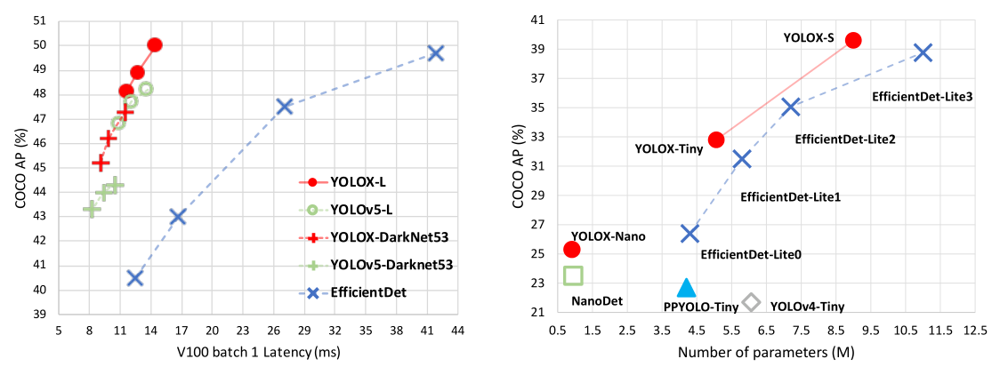
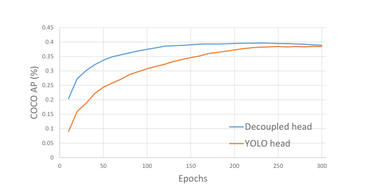
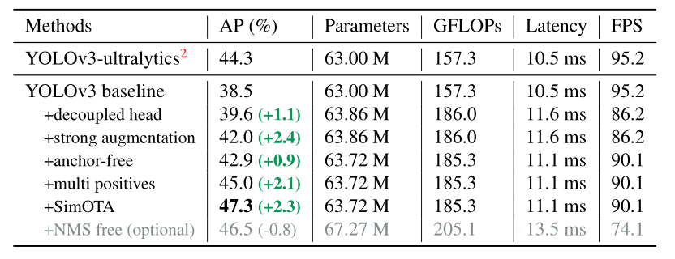
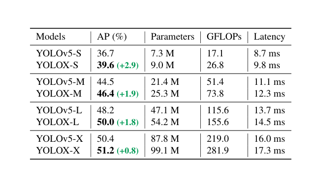
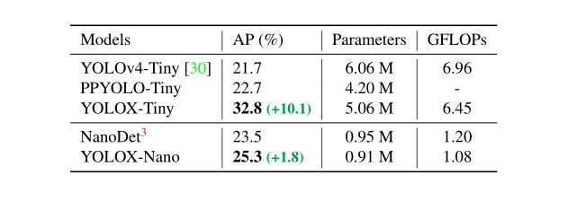
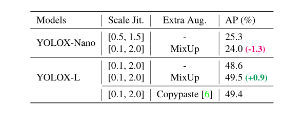
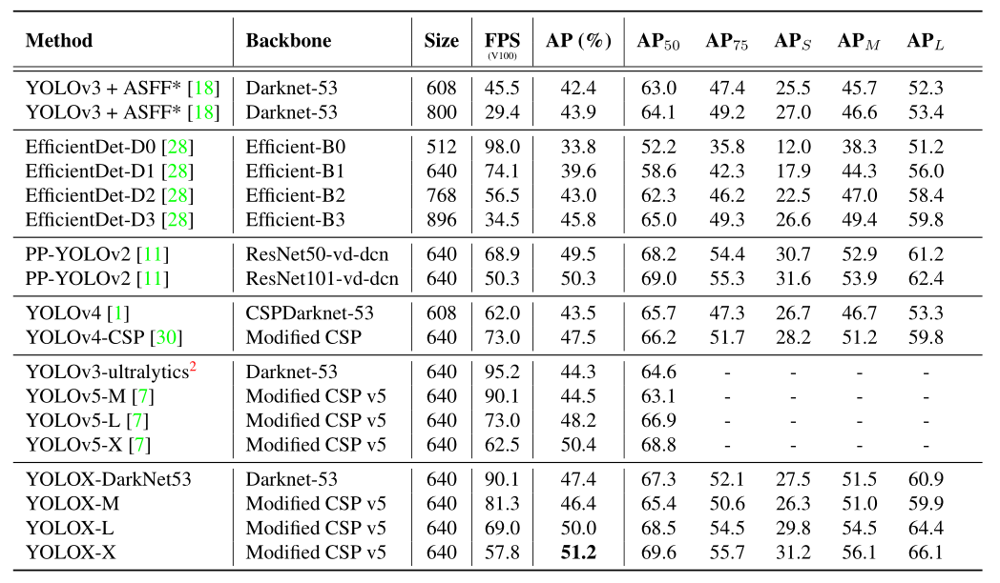

# YOLOX: Exceeding YOLO Series in 2021

---

**说明：**

- **此文章为原论文的翻译，文中提到的概念或专有名词仅仅是自己的理解所翻译，若有翻译错误，还请包涵。**
- **原论文地址：[https://arxiv.org/abs/2107.08430](https://arxiv.org/abs/2107.08430)**

---

图1：YOLOX和其他优秀的目标检测的模型的精度对比，以及和移动设备上轻量级模型的精度曲线的速度-精度权衡

## 摘要

在本报告中，我们介绍了对 YOLO 系列的一些经验改进，形成了一个新的高性能探测器——YOLOX。我们将 YOLO 检测器切换到无锚方式并进行其他高级检测技术，即解耦头和领先的标签分配策略 SimOTA，以在大量模型中实现最先进的结果：对于 YOLO- Nano 只有 0.91M 参数和 1.08G FLOPs，在 COCO 上获得 25.3% AP，超过 NanoDet 1.8% AP；对于业界最广泛使用的探测器之一 YOLOv3，我们将其提升到 COCO 上的 47.3% AP，比当前最佳实践高 3.0% AP；对于 YOLOX-L，参数量与 YOLOv4-CSP、YOLOv5-L 大致相同，我们在 COCO 上以 68.9 FPS 的速度在 Tesla V100 上实现了 50.0% AP，超过 YOLOv5-L 1.8% AP。此外，我们使用单个 YOLOX-L 模型赢得了 StreamingPerception 挑战赛（CVPR 2021 自动驾驶研讨会）的第一名。我们希望这篇文章能够帮助开发者和研究人员在实际场景中获得更好的体验。我们还提供支持 ONNX、TensorRT、NCNN 和 Openvino 的部署版本。

## 1. 介绍

随着物体检测的发展，YOLO 系列始终追求实时应用的最佳速度和精度权衡。他们提取了当时可用的最先进的检测技术（例如，用于 YOLOv2 的锚点、用于 YOLOv3 的残差网络）并优化最佳实践的实现。目前，YOLOv5 在 COCO 上以 48.2% AP，13.7 ms 保持最佳的权衡性能。

尽管如此，在过去两年中，物体检测学术界的主要进展都集中在无锚检测器、高级标签分配策略和端到端（无 NMS）检测器。这些尚未集成到 YOLO 家族中，YOLOv4 和 YOLOv5 仍然是基于锚的检测器，具有手动配置的训练分配规则。

这就是将我们所带来的原因，通过经验丰富的优化向 YOLO 系列提供了这些最新进展。考虑到 YOLOv4 和 YOLOv5 可能针对基于锚点的管道进行了稍微优化，我们选择 YOLOv3 作为我们的起点（我们将 YOLOv3-SPP 设置为默认的 YOLOv3）。事实上，由于计算资源有限，各种实际应用中软件支持不足，YOLOv3 仍然是业界应用最广泛的检测器之一。

如图1所示，随着上述技术的经验更新，我们将 YOLOv3 提升到 47.3% COCO上的AP（YOLOX-DarkNet53），分辨率为 640×640，大大超过了YOLOv3（44.3％AP，ultralytics version2）的当前最佳实践。此外，当切换到采用先进 CSPNet 主干和附加 PAN 头的先进 YOLOv5 架构时，YOLOX-L 在 COCO 数据集上以 640×640 分辨率实现了 50.0% AP，比同行 YOLOv5-L 高出 1.8% AP。我们还在小尺寸模型上测试我们的设计策略。 YOLOX-Tiny 和 YOLOX-Nano（仅 0.91M 参数和 1.08G FLOPs）分别优于对应的 YOLOv4-Tiny 和 NanoDet3 10% AP 和 1.8% AP。

我们已经在 [https://github.com/Megvii-BaseDetection/YOLOX](https://github.com/Megvii-BaseDetection/YOLOX) 发布了我们的代码，支持 ONNX、TensorRT、NCNN 和 Openvino。另外值得一提的是，我们使用单个 YOLOX-L 模型赢得了Streaming Per-ception Challenge（CVPR 2021 自动驾驶研讨会）的第一名。

## 2. YOLOX

### 2.1. YOLOX-DarkNet53

我们选择 YOLOv3 和 Darknet53 作为我们的基线。在接下来的部分中，我们将逐步介绍 YOLOX 中的整个系统设计。

**实施细节：**我们的训练设置从baseline到我们的最终模型大多是一致的。我们在 COCO train2017上对模型进行了总共 300 个 epochs 的训练，其中 5 个 epochs 作为预热。我们使用随机梯度下降（SGD）进行训练。我们使用 lr×BatchSize/64（线性缩放）的学习率，初始 lr=0.01 和余弦 lr调度。权重衰减为 0.0005，SGD 动量为 0.9。对于典型的 8-GPU 设备，批处理大小默认为 128（单GPU设置16）。其他批量大小（包括单 GPU 训练）也运行良好。输入大小从 448 到 832 以 32 步长均匀绘制。本文中的 FPS 和延迟都是在单个 Tesla V100 上使用 16 位浮点精度和 batch=1 进行的预测。

**基于YOLOv3作为准线：**我们的基线采用了 DarkNet53 主干和 SPP 层的架构，在一些论文中称为 YOLOv3-SPP。与原始实现相比，我们稍微改变了一些训练策略，添加了 EMA 权重更新、余弦 lr 调度、IoU 损失和 IoU-aware 分支。我们使用 二元交叉熵损失来训练类别 cls 和目标 obj 分支，使用 IoU 损失来训练回归 reg 分支。这些通用的训练技巧与 YOLOX 的关键改进是正交的，因此我们将它们放在基线上.而且，我们只进行 RandomHorizontalFlip、ColorJitter 和 multi-scale 进行数据增强，丢弃 RandomResizedCrops 策略，因为我们发现 RandomResizedCropis 与马赛克增强有重叠。通过这些增强，我们的基线在 COCO val 上实现了 38.5% AP，如**表 2**所示。

**解耦头：**在目标检测中，分类和回归任务之间的冲突是一个众所周知的问题。因此，用于分类和定位的 Decoupled head 广泛用于大多数一级和二级检测器。然而，随着 YOLO series 的主干和特征金字塔（例如，FPN、PAN.）不断发展，它们的检测头保持耦合，如图 2 所示。

图2：YOLOv3 头部和建议的解耦头部之间的差异图示。对于 FPN feature 的每一层，我们首先采用一个 1×1 conv 层将特征通道减少到 256，然后添加两个并行分支，每个分支有两个 3×3 conv 层，分别用于分类和回归任务。在回归分支上添加了 IoU 分支。

我们的两个分析实验表明，耦合检测头可能损害性能。 1）将 YOLO 的头部换成解耦的头部大大提高了收敛速度，如图3所示。2）解耦头对于 YOLO 的端到端版本（将在下面描述）非常方便。从表1可以看出，耦合头的端到端属性降低了 4.2% AP，而解耦头降低了 0.8% AP。因此，我们将 YOLO 检测头替换为一个 lite 解耦头，如图 2 所示。具体来说，它包含一个 1×1 conv 层以减少通道维度，然后是两个并行分支，分别具有两个 3×3 conv 层。如表 2 所示，我们在 V100 上测试了 batch=1 的推理时间发现轻量级的解耦头会带来额外1.1ms 推理时间 (11.6 ms v.s. 10.5 ms)。

图3：带有 YOLOv3 头部或解耦头部的检测器的训练曲线。我们在 COCO val 上每10 epochs 进行AP评估。很明显，解耦头比 YOLOv3 头收敛得更快，最终获得更好的结果。

表2：YOLOX-Darknet53 在 COCO val 上的 AP (%) 路线图。所有模型均在Tesla V100上以 640×640 分辨率、16 位浮点精度和 batch=1 进行测试。此表中的延迟和 FPS 是在没有后处理的情况下进行的测量。

**SimOTA：**高级标签分配是近年来物体检测的另一个重要进展。基于我们自己的研究 OTA，我们总结了高级标签分配的四个关键见解：1）损失/质量意识，2）中心优先，3）每个 ground-truth 的动态正锚框数量（缩写为动态top-k），4）全局视野。 OTA 满足上述所有四个规则，因此我们选择它作为候选标签分配策略。 具体来说，OTA [4] 从全局角度分析标签分配并将分配过程制定为一个最优传输 (OT) 问题，产生了 SOTA 性能当前的分配策略 。然而，在实践中我们发现通过 Sinkhorn-Knopp 算法解决 OT 问题带来了 25% 的额外训练时间，这对于训练 300 个 epoch 来说是相当昂贵的。因此，我们将其简化为动态 top-k 策略命名为 SimOTA，以获得近似解。

我们在这里简单介绍一下 SimOTA。 SimOTA 首先计算成对匹配度，由每个预测-gt（groundtruth）对的损失表示。例如，在 SimOTA 中，gt gi和预测 pj之间的损失计算为：

其中λ是平衡系数，Lcls 是类别损失，Lreg 是回归损失。对于gt，我们选择固定中心区域内损失最低的 k 个预测作为其正样本。最后，这些正预测的相应网格被指定为正值，而其余的网格是负值。注意到 值 k 因不同的 ground-truth 而异。详情请参考 OTA 中的 Dynamic k Estimation 策略。

SimOTA 不仅减少了训练时间，而且避免了 Sinkhorn-Knopp 算法中额外的超参数求解。如表 2 所示，SimOTA 将检测器从 45.0%AP 提升到 47.3%AP，比 SOTA ultralytics-YOLOv3 高 3.0%AP，显示了高级分配策略的威力。

**End-to-end YOLO：**（无后处理NMS）我们按照 [39] 添加两个额外的卷积层、一对一的标签分配和停止梯度。这些使检测器能够执行端到端的方式，但稍微降低了性能（0.8%AP）和推理速度（16FPS），如表 2 中所示。因此，我们将其作为一个可选模块，不放入到我们的最终模型。

### 2.2. 其他主干网络

除了 DarkNet53，我们还在其他不同尺寸的主干上测试了 YOLOX，其中 YOLOX 对所有相应的对应部分都取得了一致的改进。

表3：YOLOX 和 YOLOv5 在 COCO 上的 AP (%) 比较。所有模型均在 TeslaV100 上以 640×640 分辨率、16位浮点精度 和 batch=1 进行测试。

表4：YOLOX-Tiny 和 YOLOX-Nano 与对应物在 COCOval 上的 AP (%) 的比较。所有机型均在416×416分辨率下测试。

**Modified CSPNet in YOLOv5：**为了公平比较，我们采用了精确的 YOLOv5 主干，包括修改后的 CSPNet 、SiLU 激活和 PAN 头。我们也遵循其缩放规则来生产 YOLOX-S、YOLOX-M、YOLOX-L 和 YOLOX-X 模型。与 表中的 YOLOv5 相比。在表 3 中，我们的各个模型改进相较于 YOLOv5 提升了 ~3.0% 到 ~1.0% AP，仅仅只有边际时间增加（来自解耦头）。

**Tiny and Nano detectors：**我们将模型进一步缩小为 YOLOX-Tiny，以便与 YOLOv4-Tiny 进行比较。对于移动设备，我们采用深度卷积来构建 YOLOX-Nano 模型，该模型只有 0.91M 参数和 1.08G FLOPs。如表4所示，YOLOX 在比同行更小的模型尺寸下表现良好。

**Model size and data augmentation：**在我们的实验中，所有模型都保持几乎相同的学习计划和优化参数，如 2.1 小节所示。然而，我们发现合适的增强策略因模型的不同大小而异。如表 5 所示，虽然对 YOLOX-L 应用 MixUp 可以提高 0.9% AP，但对于像 YOLOX-Nano 这样的小型号，最好是减弱增强效果。具体来说，我们在训练小模型（即 YOLOX-S、YOLOX-Tiny 和 YOLOX-Nano）时去除了混合增强并削弱了马赛克（将比例范围从 [0.1, 2.0] 减小到 [0.5, 1.5]） .这种修改将 YOLOX-Nano 的 AP 从 24.0% 提高到 25.3%。

对于大型模型，我们还发现更强的增强更有帮助。事实上，我们的 MixUp 实现比 [38] 中的原始版本更重。受 Copypaste 的启发，我们在混合它们之前通过随机采样的比例因子对两个图像进行抖动。为了理解 Mixup 与缩放抖动的威力，我们将其与 YOLOX-L 上的 Copypaste 进行比较。注意到 Copypaste 需要额外的实例标注信息，而 MixUp 不需要。但如表5所示，这两种方法都取得了有竞争力的性能，表明当没有实例标注信息可用时，带有缩放抖动的 MixUp 是 Copypaste 的合格替代品。

表5：不同模型大小下数据增强的效果。 “Scale Jit”代表马赛克数据增强的尺度抖动范围。采用 Copypaste 时使用来自 COCO trainval 的实例标注信息。

## Comparison with the SOTA

通常有个惯例如表 6 所示，显示各个模型的比较。 但是请记住，此表中模型的推理速度通常不受控制，因为速度随软件和硬件而变化。因此，我们对图 1 中的所有 YOLO 系列使用相同的硬件和代码库，绘制了一些受控的速度/精度曲线。我们注意到有一些高性能 YOLO 系列具有更大的模型尺寸，如 Scale-YOLOv4 和 YOLOv5-P6 。而当前基于 Transformer 的检测器将准确度-SOTA 推高到 ~60 AP。由于时间和资源限制，我们没有在本报告中探讨这些重要特征。但是它们已经在我们的研究范围内。

表6：COCO 2017 test-dev 上不同物体检测器的速度和精度对比。我们选择在 300 个 epoch 上训练的所有模型进行公平比较。
